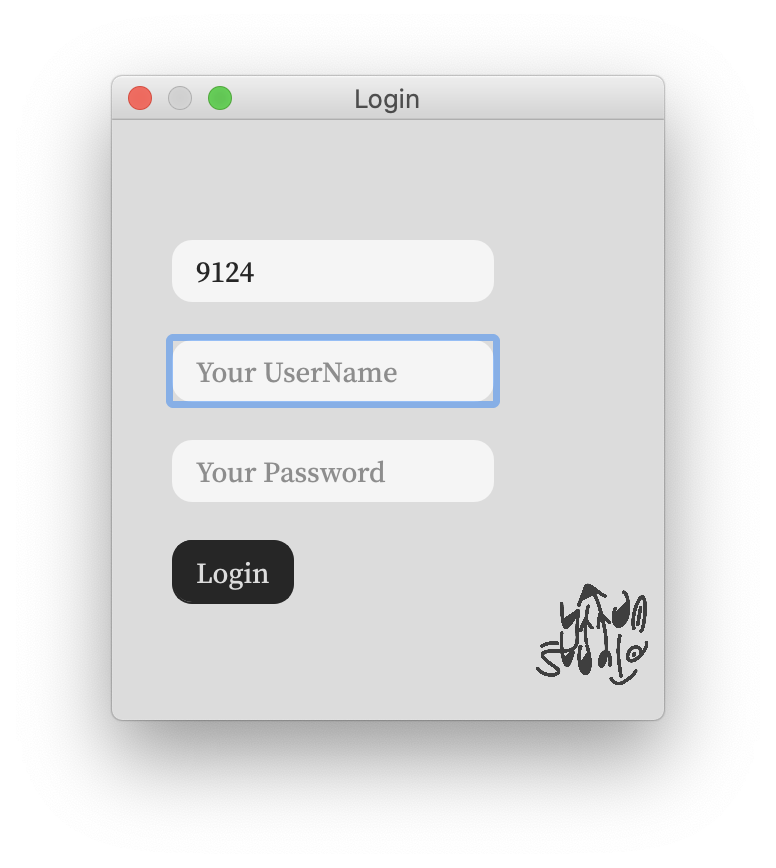
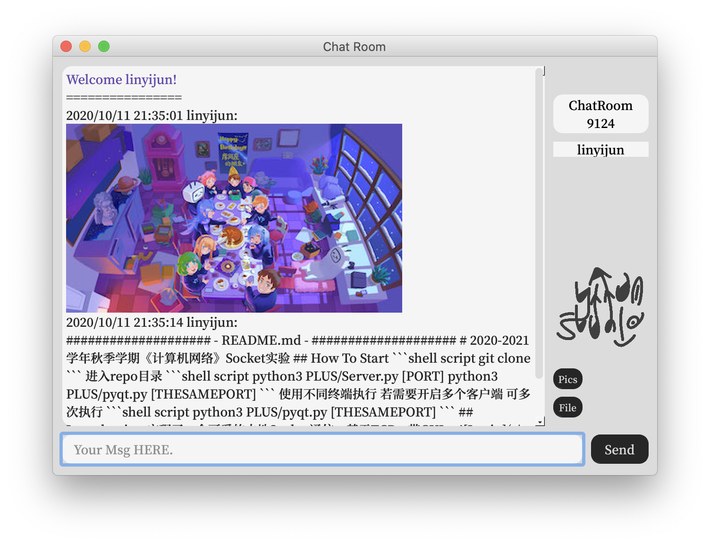

# 2020-2021学年秋季学期《计算机网络》Socket实验
## How To Start
```shell script
git clone
```
进入repo目录
```shell script
python3 PLUS/Server.py [PORT]
python3 PLUS/pyqt.py [THESAMEPORT]
```
使用不同终端执行
若需要开启多个客户端
可多次执行
```shell script
python3 PLUS/pyqt.py [THESAMEPORT]
```
## Introduction
实现了一个可爱的本地Socket通信，基于TCP，带GUI。
{:height="50%" width="50%"}

Socket文件夹下为命令行版本，含TCP及UDP。